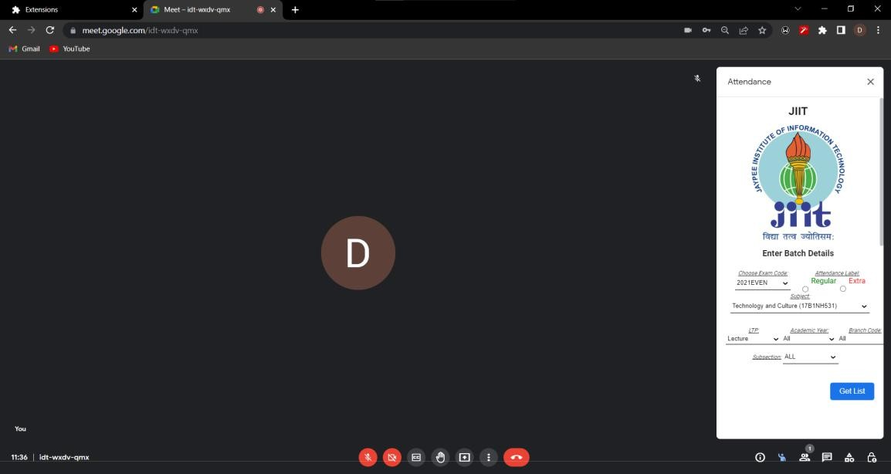
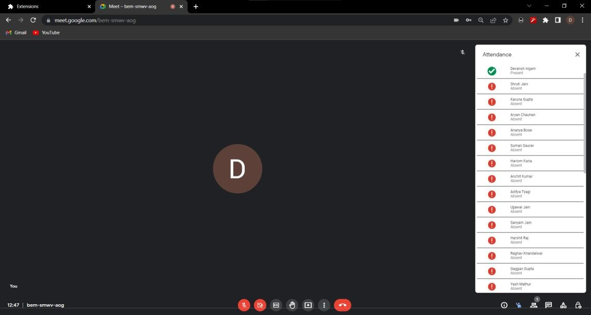
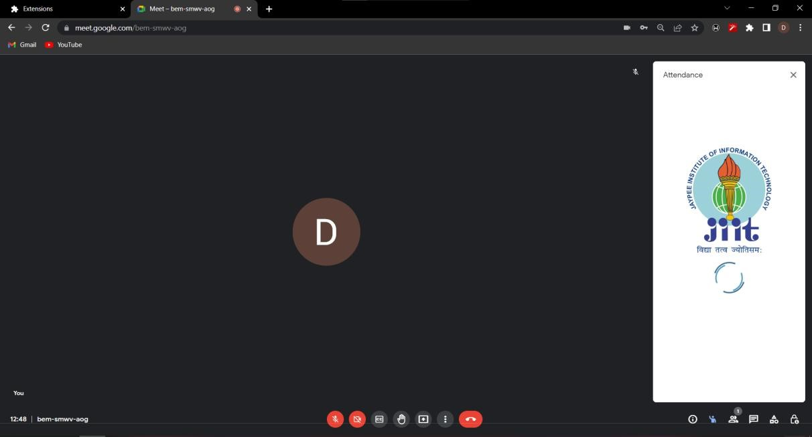
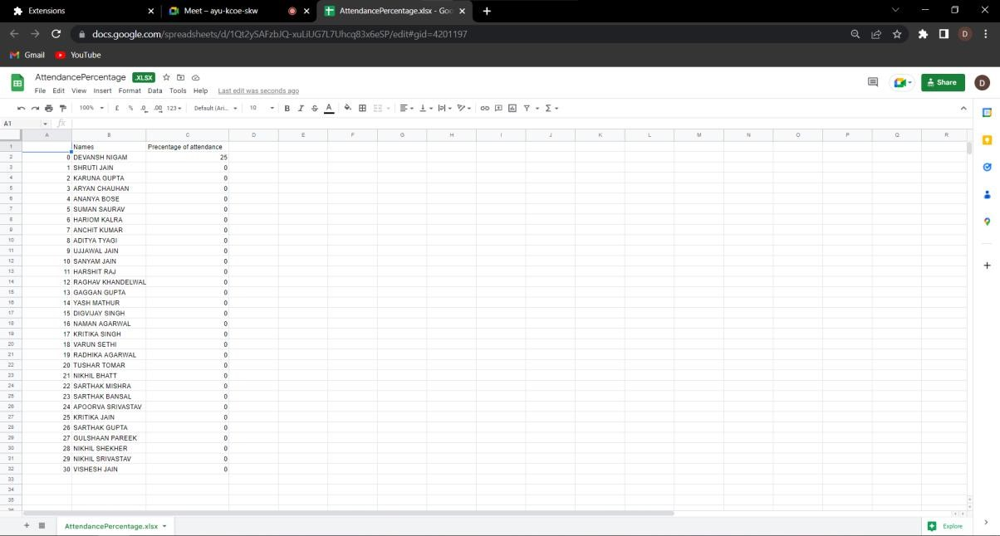

# GoogleMeet Attendance Tracker

It's a google chrome extension which trackes the Attendance of the students present in the googlemeet and after the meet is ended it uploads it to the webkiosk of the JIIT college.

## Screenshots

